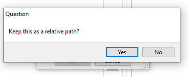

# 🧩 Satisfier API Integration with Code::Blocks

A step-by-step tutorial demonstrating how to integrate the Satisfier API (`client.cpp`, `satisfier.hpp`, `satisfier.dll`, `libsatisfier.a`) into a Code::Blocks C++ project, using Dynamic Link Library (DLL). For resources on origin of the word "satisfier", read Harvey M. Friedman [`Adventures in Logic for Undergraduates`], and [`The Dynmamics of Decision-Making Styles` Decision Dynamics Europe].  

[`Adventures in Logic for Undergraduates`]: https://github.com/calebnwokocha/satisfier/blob/main/articles/LogicalConn012610-pydfqy.pdf
[`The Dynmamics of Decision-Making Styles` Decision Dynamics Europe]: https://github.com/calebnwokocha/satisfier/blob/main/articles/the_dynamics_of_decision-making_styles.pdf

---

## 🛠 Prerequisites

- **Operating System**: Windows with Code::Blocks + MinGW
- **Files** required in your project folder:
  - `client.cpp`—find it in `clients`
  - `satisfier.hpp`
  - `satisfier.dll`—find it in `bin/Debug`
  - `libsatisfier.a`—find it in `bin/Debug`
If you are downloading Code::Blocks for the first time, then you don't need this tutorial. Just download `codeblocks-satisfier-nosetup` via https://huggingface.co/caletechnology/codeblocks-satisfier-nosetup/tree/main and open `client.cpp`
---

## 🏗️ Integration

1. **Create Console Project**  
   `File → New → Project → Console Application (C++)`

2. **Add files**  
   Copy `client.cpp`, `satisfier.hpp` into the project directory.

3. **Linker Settings**  
   - *Project → Build options → Linker settings*  
   - Under *Link libraries* click the *Add* button to add `libsatisfier.a` file
      
   - When the above dialog box appear, choose *No*
   - To debug, link again and choose *Yes* in dialog box
5. **Copy .dll**  
   - Comment erroneous code in main function of `client.cpp`
   - Build your project to compile `.exe` executable
   - Copy `satisfier.dll` next to the compiled executable
   - Uncomment code in the main function of `client.cpp`

6. **Build & Run**  
   - Press **F9**—the project dynamically loads the DLL at runtime.

---

## □ Proofs

Regarding context rule, read Yannis Kassios [`Formal Proof`]. Also read A. N. Prior [`The Runabout Inference-Ticket`], to prove that `A. And (B)` is not equivalent to `A. Tonk (B)`. Nuel D. Belnap [`Tonk, Plonk and Plink`] says that both `A,B` are deducible from `A. And (B)` in synthetic mode of logic relying on context.

[`Formal Proof`]: https://github.com/calebnwokocha/satisfier/blob/main/articles/formal_proof-1.pdf
[`The Runabout Inference-Ticket`]: https://github.com/calebnwokocha/satisfier/blob/main/articles/Prior-RunaboutInferenceTicket-1960.pdf
[`Tonk, Plonk and Plink`]: https://github.com/calebnwokocha/satisfier/blob/main/articles/Belnap-TonkPlonkPlink-1962.pdf

When using Satisfier API to do formal proof, if you have consecutive disjunctions e.g., `A. Or (B). Or (C)` and you supposed only literal `C` is true, then type `C. Or (A). Or (B)` instead of `A. Or (B). Or (C)` to minimize number of recommendations from the API.
